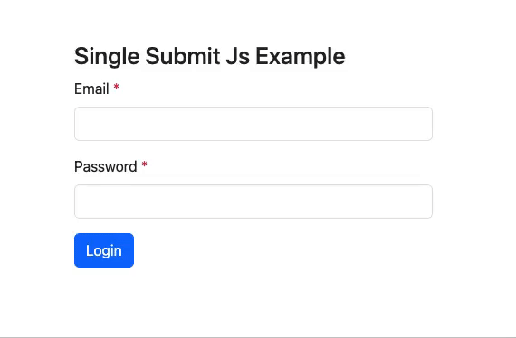

# Single Submit Js

In scenarios involving actions like file uploads or form submissions, waiting for server responses can be
time-consuming. By integrating this library, enhance user experiences with a processing indicator and prevent duplicate
submissions until a response is received, resulting in a more efficient interaction.



**Key Features**

- Prevent duplicate form submission.
- Native HTML form validation.
- Works independently of any CSS framework.
- Compact file size of less than 1KB.
- Quick setup with a CDN link.
- Supports customizing processing indicators.

## Quick Start

```html
<form method="post" data-ss-type="single-submit-form" data-loading-text="Submitting...">
    <!-- Your form fields here -->
    <button type="submit">Submit</button>
</form>


<!-- Add CDN link -->
<script src="https://cdn.jsdelivr.net/gh/priyashpatil/single-submit-js@2.0.0-alpha/dist/single-submit.min.js"
    crossorigin="anonymous" referrerpolicy="no-referrer"></script>

<!-- Initialize on dom load -->
<script>
    document.addEventListener("DOMContentLoaded", () => {
        SingleSubmit.init();
    });
</script>
```

## Installation

**Using CDN link:**

```html
<script src="https://cdn.jsdelivr.net/gh/priyashpatil/single-submit-js@2.0.0-alpha/dist/single-submit.min.js"
    crossorigin="anonymous" referrerpolicy="no-referrer"></script>
```

**Using npm package:**

```shell
npm i single-submit
```

Once the package is installed, you can import the library using import or require approach:

```js
// Using default default export.
import SingleSubmit, { SingleSubmitOptions } from 'single-submit';

// or If you use require for importing, only default export is available.
const SingleSubmit = require('single-submit').default;
const { SingleSubmitOptions } = require('single-submit');
```

## Configuring forms

Add the `data-ss-type="single-submit-form"` attribute to your form and optionally include the `data-loading-text`
attribute to specify the text displayed during processing. Here's an example:

```html
<form method="post" data-ss-type="single-submit-form" data-loading-text="Submitting...">
    <!-- Your form fields here -->
    <button type="submit">Submit</button>
</form>
```

## Customize the process indicator

Out of the box, there is one indicator available: `spinner-border-single-submit`. You can switch to any other indicator
by specifying the `data-ss-indicator` attribute to the form or button or passing the indicator class in init options.

The following example using assuming you are using Bootstrap's `spinner-grow` class. However you can specify you custom
class to customize the process indicator animation.

**Using `data-ss-indicator`:**

```html
<!-- Assuming you are using Bootstrap -->
<form data-ss-type="single-submit-button" data-ss-indicator="spinner-grow">
    <!-- Your form fields here -->
    <button type="submit">Submit</button>
</form>
```

**Using `SingleSubmit.init()` options:**

```js
SingleSubmit.init({
    processIndicatorClass: 'spinner-grow', // assuming you are using Bootstrap
});
```

To further customizing the implementation refer to API.

## API

Single submit offers the following options. The `containerClass` allows to override the default container class
`spinner-container-single-submit` for edge cases.

```js
interface SingleSubmitOptions {
    containerClass?: string;
    processIndicatorClass?: string;
}
```
